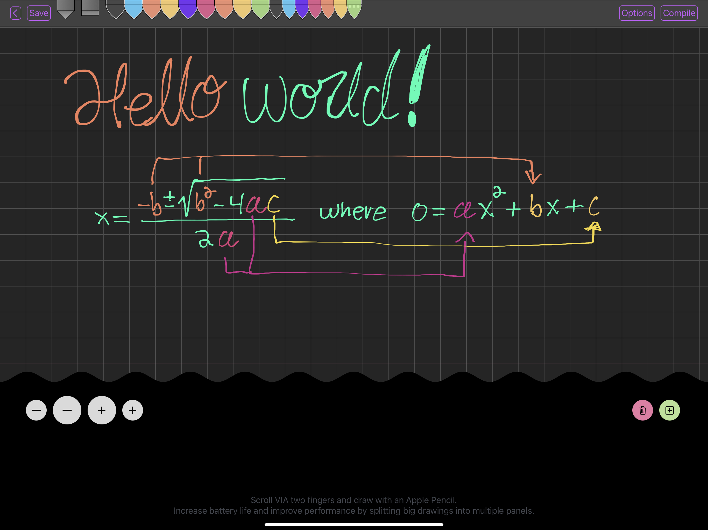

# Features

## Subscript Markup Language

- Based on HTML markup with LaTeX like syntax.

The following code examples hereto use tex based syntax highlighting (there is a vscode syntax extension for Subscript Markup) and I suppose you'll be able to see quite plainly where Subscript breaks LaTeX parsers.

### Math Support 

| Cmd | Type |
|---|---|
| `\math{…}` | Math Block |
| `\{…}` | Inline Math |
| `\equation{…}` | Math Block where the environment is equivalent to LaTeX's equation + split env |

### File Import Support With Relative Headings

For example
```tex
\h1{Hello world}
\include[path="test/hello.ss", baseline="h2"]
//                             ^^^^^^^^^^^^^
//                      (Decrements all h1-h6 tags by 1)
```

Furthermore, this rule is recursively applied in a bottom-up fashion when files import other files that import other files and so forth (I really wish there were more HTML heading tags). So in any `.ss` file, always begin with H1 and decrement sub-headings relative to such (so the headings therefrom will result in the appropriate level in any given hierarchical context of file imports).

### Automatic Table Of Content Generation

Currently being reimplemented to better handle multi-page and nested (hierarchical) page layouts.


### Unicode Support and Typography
- The parser is based on the `unicode-segmentation` crate (which identifies Grapheme Cluster, Word and Sentence boundaries according to Unicode Standard Annex #29 rules).
- Unicode beautification of characters such as mapping `"..."` → `“…”` (WIP).
    - In the compiler AST, there is a generalized notion of 'enclosures', such as open/close `{}`, `[]`, and `()` (to be used in math-math for automatic parens sizing), yet supporting enclosures where the open/close tokens are the same character is a little more challenging on the parsing side (especially with regards to handling invalid cases in some way)…
    - Rudimentary support for parsing "…" has been implemented, and it's behavior is determined by the context in which it is used (e.g. in text/display mode `"…"` will map to `“…”`).
- Annotating text with `<wbr>` metadata and the like (WIP).

### Local (anonymous) rewrite rules (VIA the `\!where` macro)

```tex
\note{
    \h1{The Quadratic Formula}
    \math{
        x = \frac{\num}{\den}
    }
}\!where {
    {\num} => {-b \pm \sqrt{b^2 - 4ac}}
    {\den} => {2a}
}
```

- Currently mappings of `pattern => target` only work if `pattern` is a single parse tree element/node, eventually I'll get around to supporting more sophisticated patterns... 
- This was initially motivated by the ungodly mess that happened when I tried to color-code a complex bit of LaTeX math, where the resulting markup thereafter was incredibly hard to read... What I wanted was something akin to
    ```tex
    \section {
        …[lots of math code]…
    }
    \!where {
        {\Delta_x} => {\colorA{\Delta_x}}
        {\Delta_y} => {\colorA{\Delta_y}}
        {\Delta_z} => {\colorA{\Delta_z}}
        {x_1} => {\colorB{x_1}}
        {y_1} => {\colorB{y_1}}
        {z_1} => {\colorB{z_1}}
        …
    }
    ```

The convention in Subscript is that macros that begin with an exclamation mark modify the preceding element in some way (such as `\element{…}\!where{…}`), whereas those that end in an exclamation mark modify succeeding elements or the global scope/environment in some way…


### Integration with hand drawn notes VIA your iPad and Apple Pencil



> `SubscriptDraw` is a freehand/freeform drawing app (iPad only and requires an Apple Pencil) for rapid note taking and freeform content creation such as diagrams and hand drawn visualizations. Which the Subscript Markup Language and compiler natively supports for seamless integration into your published content. 


Overall

- SubscriptDraw save your drawings as `.ssd1` files (where `ssd1` stands for Subscript Drawing Version-1), which can be imported and manipulated in the Subscript Markup Language.
- `.ssd1` files are essentially vector objects and are therefore resolution independent.
- The strokes are rendered into relatively beautiful SVG paths (compared to other implementations out there was used ugly fixed diameter strokes with hard cutoffs).
- The app implementation is located under `./IOS/SubscriptDraw`, and eventually I'll port over the notebook version as well (which contains drawings and H1-H6 heading tags). It's not yet available on the App Store since dev licenses are expensive (but you don't need a dev license to compile and run your own iPad). Although if this project gains traction with users, I may eventually publish such to the app store... 


#### Example


```tex
\layout[2col]{
    \include[src="test/Untitled.ssd1"]\!where{
        {\drawing} => {
            \note{
                \h1{Hello Drawing}
                \hr
                \drawing
            }
        }
    }
}
```

Each drawing can contain multiple drawing entries. By default
```tex
\include[src="test/Untitled.ssd1"]
```
will map to a div of SVG's (essentially a single image), but you can customize how each SVG is presented VIA the `\!where` macro like so
```tex
\include[src="test/Untitled.ssd1"]\!where{
    {\drawing} => {
        \note{
            \h1{Hello Drawing}
            \hr
            \drawing
        }
    }
}
```


## Lots more planned! 


# Sub-projects Overview

- `./IOS/SubscriptDraw`
    + iPad freehand/freeform drawing app VIA your Apple Pencil for rapid note taking and freeform content creation such as diagrams and hand drawn visualizations. Which the Subscript Markup Language and compiler natively supports for seamless integration into your published content. 
    + `SubscriptDraw` save your drawings as `.ssd1` files (where `ssd1` stands for Subscript Drawing Version-1), which can be imported and manipulated in the Subscript Markup Language (`.ssd1` files are essentially vector objects and are therefore resolution independent).
    + The strokes are rendered into beautiful SVG paths.
        - ∴ This IS NOT a shitty rendering of hand drawn strokes -although it could be better- but nonetheless great pains have been taken to produce relatively beautiful SVG paths, compared to other implementations out there was used ugly fixed diameter strokes with hard cutoffs.
- `./subscript-compiler`
    - The compiler implementation for the subscript markup language (i.e. `.ss` files). Can be used directly (TODO CLI), or indirectly in an automated manner VIA the `subscript-project` tool. 
- `./ss-language-server`
    + Dev tools/plugins for your text-editor
        - `./ss-language-server/vscode-subscript-markup-language`
            + Basic syntax highlighting for `.ss` files.
        - `./ss-language-server/vscode-subscript-autocomplete`
            + Basic autocomplete for `.ss` files.
        - Eventually there will be a rust language server that uses the compiler for analysis. But for now, the rust project (`ss-language-server`) is currently unimplemented, since `vscode-subscript-markup-language` and `vscode-subscript-autocomplete` works well enough for now... 
- `./subscript-project`
    - The toolchain for subscript projects with a focus on compiling to the web (i.e. not PDF's), essentially akin to an opinionated static site generator.
- `./example-project`
    + example project showcasing a subscript project using the `subscript-project` toolchain.
- `./format-ss-drawing`
    + Internal (used by `subscript-compiler`)
        + Parser for `.ssd1` files (where `ssd1` stands for Subscript Drawing Version-1)
        + SVG compiler for `ssd1` drawing entries.
- `./subscript-web-trinity`
    + Internal (used by `subscript-compiler` and `subscript-project`)
        + The “web-trinity” part refers to implementing support for parsing, manipulating, and rendering HTML/CSS/JS code. 

## Supported Compilation Targets/Formats

| Format | Supported |
|---|---|
| Web Target (HTML/CSS/JS) | ✅  |
| PDF Target | ❌ |

Regarding PDF support, there are multiple options to chose from

- `Paged.js`: One such option is to use `Paged.js` or something related, which are generally built upon the `CSS Paged Media Modules` for defining layout and content that maps to pages.
    - Originally my aspiration for Subscript was to be a content publishing platform using web technologies VIA a LaTeX like system, and therein benefit from the vast and myriad array of preexisting stuff that arguably outnumbers the feature-set provided by LaTeX packages... The problem is, PDF rendering VIA a browser is terrible! The design side isn't all that bad, but for some reason simple things like selecting and highlighting text doesn't work on my MacOS provided PDF renderer/client (no idea why).
        - But the uniformity benefit is HUGE! If technical problems can be worked out this is a very attractive option... 
- Another option is to use a hybrid approach, and render graphics VIA a browser, and use something else for overall layout and text rendering...
- Part of me likes the idea of integrating with the SILE typesetter -if only it was implemented in rust! I know how to work with C++ and embed such in a rust project, but it's a massive pain and complicates a multitude of things... Especially with regards cross-compilation and running in a browser environment/runtime...
- Just re-implement the SILE typesetter in rust.


# Development

## TODOs

- Compilers are built upon rewrite rules, and I try to implement such in an organized fashion VIA rust’s macros. There is opportunity to rework the macro system to also provide autogenerated autocomplete information.
    * Therefore improve the macro system in
        + `subscript-compiler/src/plugins/normalize.rs`
        + `subscript-compiler/src/plugins/pre_html.rs`
    * Notably,
        + Rework the macros to provide better information to autocomplete
        + Use rust's doc-comments for autocomplete docs (akin to how StructOpt works for CLI docs).
- Regarding `subscript-project`
    + Allow third party libs to define their own Subscript macros.

## TODOs - Miscellaneous

There is rudimentary support for defining rewrites in a managed, organized manner, see,
- `subscript-compiler/src/plugins/normalize.rs`
- `subscript-compiler/src/plugins/pre_html.rs`

The different between `normalize.rs` and `pre_html.rs` is somewhat arbitrary. But generally speaking, `pre_html.rs` is for HTML specific rewrites that we apply before passing the AST onto the HTML codegen (for instance if it's shared between a possible PDF backend and the HTML backend alike, add it to `normalize.rs`). 

Anyways the macro system/interface is the same for both. Here is an example of wrapping tables in a wrapper div to properly implement horizontally scrollable tables on Safari (and is therefore obviously goes under `pre_html.rs`):

```rust
register_tag_macros!{
//   (namespace)
//      ↓↓
//     ~~~~~
    fn global::table(env, table) {
//             ^^^^^
//          (element name)
        let mut attrs = Attributes::default();
        attrs.insert_key("data-table-wrapper");
        let wrapper = Tag::new_with_param("div", attrs, vec![Node::Tag(table)]);
        Node::Tag(wrapper)
    }
}
```

The benefit of using macros systems overall is that this can be extended to e.g. automatically generating a list of all Subscript macros (which can be useful for e.g. autocomplete), although the above system doesn't express macro arity and is a TODO. The same idea would be convenient for the HTML codegen as well (something that would be nice to have **-but isn't a big priority is-**), especially on the CSS styling side where rules that match against subscript macros are automatically converted into their HTML equivalence

For instance the `note` selector in the following
```css
note {
    color: red;
}
```

May get rewritten to e.g.
```css
section[--data--note-tag] {
    color: red;
}
```

Therefore it would be convenient to have an macro based HTML codegen that can record what Subscript macros map to, and use the associated list to automatically derive the CSS selector rewrites. Although it's not a huge priority since Subscript doesn't define very many tags that deviate from HTML... 


### Notes

