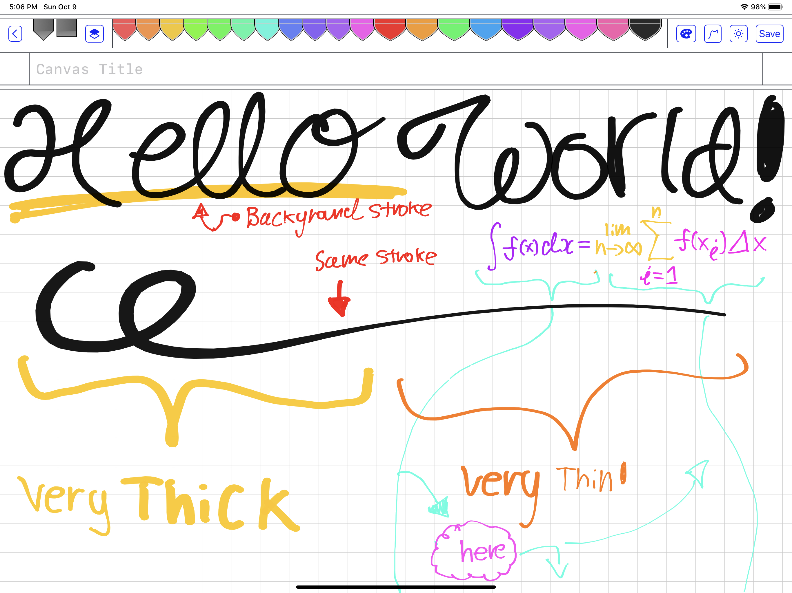
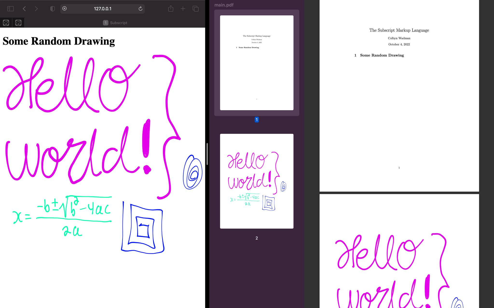

# Welcome to the SubScript Note-Taking & Content Publishing Tools
> Behold the culmination of my failing school grades. Been too obsessed with this project for some reason… Next semester should be great though with the perfect tools that conform to my preferred note-taking workflow, from beautifully typesetted (but relatively time consuming) LaTeX math and other markup, to rapid hand drawn notes when time constrained —**all in one and seamlessly intermixed**.

**This is only a preview - not yet ready for public consumption!** Unless you wanna hack on the code (and know how to work with rust).

# Things are moving fast - Most of Subscript is undocumented

This readme is perpetually out of date. If you want to see the entire list of currently implemented commands, go to `subscript/subscript-compiler/src/ss_v1_std/`, [over here](https://github.com/subscript-publishing/subscript/tree/master/subscript-compiler/src/ss_v1_std) and check out the following files (be sure to check out the top-level dir as well in case new files are added):

- [core](https://github.com/subscript-publishing/subscript/blob/master/subscript-compiler/src/ss_v1_std/core.rs)
- [formatting](https://github.com/subscript-publishing/subscript/blob/master/subscript-compiler/src/ss_v1_std/formatting.rs)
- [html_tags](https://github.com/subscript-publishing/subscript/blob/master/subscript-compiler/src/ss_v1_std/html_tags.rs)
- [html_sugar](https://github.com/subscript-publishing/subscript/blob/master/subscript-compiler/src/ss_v1_std/html_sugar.rs)
- [symbolic](https://github.com/subscript-publishing/subscript/blob/master/subscript-compiler/src/ss_v1_std/symbolic.rs)

But this doesn't cover everything, especially on the LaTeX math/chem side. 

Likewise, be sure to check out the `./example-project` [over here](https://github.com/subscript-publishing/subscript/tree/master/example-project) as well and it's sub-pages.  

When Subscript nears it's MPV, I'll replace the hardcoded stuff in `subscript/src/main.rs` with a CLI interface. 


## Features

#### **Content publishing VIA Web-Technologies!** (WIP)

There are TONS of JS libs that do very specific things (for literally everything) that no-one ever uses outside perhaps an official web-app, for instance Desmos and GeoGebra are trivially embeddable but people hardly ever use their JS APIs. The goal of Subscript is to make this as convenient as possible with a declarative non-programming API for each. Something akin to e.g. exclusively using HTML tags for each in a declarative manner.

WIP:
- The compiler infrastructure is there, but I’m very time constrained, so the only stuff thats currently getting implemented is stuff that solves immediate needs and problems in my projects. But for an example of what the API may look like, for instance, here is a version I wrote some time ago that embeds Desmos VIA an HTML interface ([source](https://github.com/colbyn/school-notes/blob/main/build/posthtml-custom-elements/index.js#L529)): 
    ```html
    <desmos root-options>
        <expr expr-options>y=x^2</expr>
    </desmos>
    ```


In a certain regard, SubScript is basically LaTeX, except, while you loose out on it's massive array of packages that do everything from math to extremely fine tuned musical notation rendering, you instead get a WIP LaTeX-like interface to the COLOSSAL JS ecosystem.

- For instance, need to publish content with musical notation? Maybe I'll one day add support for [VexFlow](https://www.vexflow.com) so I say that Subscript supports rendering complex musical notation. Can markdown do that? Or better yet, will markdown ever do that?

In 2022 popular markdown displays are finally getting support for displaying math, but it's still relatively limited with regards to the feature-set LaTeX provides.

The goal of Subscript is to be a **monolithic publishing platform** for everything under the sun, and by monolithic, I mean monolithic. While red flags may go off in your head, I've tried AsciiDoc, and the problem with AsciiDoc is that it's both slow, incredibly slow after a while, and especially, there's no syntax highlighting or autocomplete of embedded content! In theory AsciiDoc's idea of extensibility sounds nice, it may please your enterprise system architect, but it leads to a multitude of annoyances (to say the least) that you simply don't have with LaTeX. Furthermore, AsciiDoc makes assumptions that wouldn't easily translate to a browser environment. Whereas a monolithic architecture entails end-to-end uniformity.

In theory, Markdown based content publishing tools has the same issue, I've seen platforms built upon markdown with extra features, but will your stock markdown syntax highlighter support such? Whereas e.g. if you see a LaTeX package, odds are it supports the entirety of (Xe)LaTeX syntax and whatnot.


#### JavaScript Library WIP

- [Desmos](https://www.desmos.com/api/v1.7/docs/index.html)
- [GeoGebra](https://wiki.geogebra.org/en/Reference:GeoGebra_Apps_Embedding)


E.g. the basic API will be
```
\desmos{
    \expr[line-style='dashed']{y=x^2}
}
```

#### JavaScript Library Proposals

- [Pts](https://ptsjs.org)
- [Anime](https://animejs.com)
- [Mafs](https://mafs.dev)
- [chartjs](https://www.chartjs.org)
- [plotly](https://plotly.com/javascript/)
- [ChemDoodle](https://web.chemdoodle.com)
- [Smiles Drawer](https://github.com/reymond-group/smilesDrawer)
- [biojs](https://biojs.net/#/)
- [VexFlow](https://www.vexflow.com)

### **Content publishing VIA the Rust Ecosystem

Subscript is natively written is rust and can offer seamless integration to the growing collection of rust libraries for compile-time transformations and functionality. 


#### Rust Library Proposals

- [stanza](https://crates.io/crates/stanza)
- [voikko-rs](https://crates.io/crates/voikko-rs)
- [typos](https://crates.io/crates/typos)
- [varcon](https://crates.io/crates/varcon)
- [analiticcl](https://crates.io/crates/analiticcl)
- [lingua](https://crates.io/crates/lingua)
- [LNGCNV](https://crates.io/crates/lngcnv)
- [etym](https://crates.io/crates/etym)
- [gnverify](https://crates.io/crates/gnverify)
- [Morsels](https://crates.io/crates/morsels_indexer)
    + SubScript definitely needs static site search.

Until I figure out how to make SpellRight aware of Subscript Syntax, I'm thinking a CLI feature for warning about miss-spelling would be the simplest solution, and editor independent.


### Subscript Markup Language

- Built upon LaTeX-ified HTML tags.
    - Meta:
        - (Except in Subscript, instead of calling things like `\h1{…}` a tag, it's a command (you can go on calling it a tag, idc. Originally, in the compiler implementation I used the tag terminology for relevant names, but this was later changed without any particular conscious reason, perhaps's it was just less confusing given it's LaTeX-like syntax, regardless this is what stuck.)
    - Therefore, in Subscript:
        - all command identifiers begin with a slash `\` (which is an easy trigger for auto-complete),
        - while macros with specially implemented behavior (in the compiler) end in an exclamation mark (`!`) (inspired by rust).
    - **A command is broken down into** `\name[attributes]{arguments}`
    - For instance,
        - `\h1{Hello World}`
        - `\include[src="./path/to/filename.ss"]`
        - `\layout[cols=3]{…}`
        - `\frac{1}{2}`
    - Generally speaking:
        - For all HTML based commands, the overall format is
            - `\name[attributes]{argument}` or `\name[attributes]`
        - For all LaTeX based commands, the overall format is 
            - `\name[attributes]{arg1}{arg2}…{argN}`
    - Some commands are only available if it's nested under a `parent` command, for instance, `\row` is only available if it's nested under a `\table` command. (It's a variable arity/argument convenience command for creating a table row where each argument is automatically wrapped in in a table-data element (if its not already), since HTML tables are very verbose and I've been trying to streamline their creation for fast notes).
        - (I call these convenience commands that simply expand out to more verbose HTML trees "HTML sugar")
- Compile your notes to HTML webpages, or PDF files (very long-term WIP).
- Seamlessly intermix markup with hand drawn content VIA the Subscript Freeform Tools (iPad only).
- Seamless dark/light mode support throughout all subscript tools. 

#### Math Support 

| Cmd | Type | Notes |
|---|---|---|
| `\math{…}` | Math Block ||
| `\{…}` | Inline Math |Due to how frequently it's used, I made it's invocation as short as possible |
| `\equation{…}` | Math Block |The default environment is equivalent to LaTeX's equation + split env|

Also the `\math` command support a few options for quickly defining common environments and whatnot, as shown in the following example (the `num` and `tag` options also work for `\equation`):

Which results in:


| Value | Shorthand | Notes |
|---|---|---|
|`equations`|`e`||
|`centered`|`c`||

When I update the `\where!` macro to support rewriting attributes, you'll be able to use such to keep track of labels within a local expression. Which will be something akin to: 


By default numbered expressions are turned off, because I want a better interface for such than what KaTeX provides.

#### Layout

Things can be broken down into newspaper like columns VIA the `\layout[col=num]` command, for instance,


By default this also includes breakpoints that will decrement columns as the viewport width decreases until it breaks into single column mode.

While the `\grid` command gives you access to very fine tuned CSS grids:


### File Import Support With Relative Headings

For example


Furthermore, this rule is recursively applied in a bottom-up fashion when files import other files that import other files and so forth (I really wish there were more HTML heading tags). So in any `.ss` file, always begin with H1 and decrement sub-headings relative to such (so the headings therefrom will result in the appropriate level in any given hierarchical context of file imports).

### Automatic Table Of Content Generation

Currently being reimplemented to better handle multi-page and nested (hierarchical) page layouts.

Currently looks like this (in dark mode):


### Unicode Support and Typography
- The parser is based on the `unicode-segmentation` crate (which identifies Grapheme Cluster, Word and Sentence boundaries according to Unicode Standard Annex #29 rules).
- Unicode beautification of characters such as mapping `"..."` → `“…”`

### Local (anonymous) rewrite rules (VIA the `\where!` macro)


This was initially motivated by the ungodly mess that happened when I tried to color-code a complex bit of LaTeX math, where the resulting markup thereafter was incredibly hard to read... What I wanted was something akin to


#### **Update** 

**WARNING**: I forgot to include ‘;’ at the end of each rewrite rule! Due to recent changes to the parser. It should instead look like this:


### Integration with hand drawn notes VIA your iPad and Apple Pencil (With Dark/Light Mode Support!)


For rapid note taking and freeform content creation such as diagrams and hand drawn visualizations. Which the Subscript Markup Language and compiler natively supports for seamless integration into your published content. 




Safe your files to e.g. `iCloud Drive` and seamlessly include such in your notes 


- Freeform files are essentially vector objects and are therefore resolution independent.
- The strokes are rendered into relatively beautiful SVG paths (compared to other implementations out there that used ugly fixed diameter strokes with hard cutoffs).
- NOTE: It's not yet available on the App Store since dev licenses are expensive (but you don't need a dev license to compile and run on your own iPad). Although if this project gains traction with users, I may eventually publish such to the app store... 

Each freeform file can contain multiple drawing entries, which can be manipulated & formatted like so (VIA the `\where!` macro):


Notes:
- This interface is **unstable and likely to change** and may currently be broken. 
- At the time of this writing, drawing rewrite rules are only supported for `.ss1-drawing` files, since `.ss1-composition` files are more complicated and I haven't worked out how the interface should work.  

#### Drawing Editor Overview (same for all apps)


Regarding the pen list:
- `Foreground` pens point down
- `Background` pens point up
- The `Foreground`/`Background` feature allows you to underline and highlight things and have such highlights render ‘underneath’ foreground strokes (it just looks nicer). 

#### Page Layout Editor Overview
> This feature is specific to the ‘SubscriptComposition’ app.


## Lots more planned! 

# Development

## Miscellaneous Notes

I’ve overhauled the parser (didn’t realize how bad the previous implementation was), and the core compiler data models, with a unified interface for command declarations, where commands can be implemented and made available in a very fined tuned manner.

So you can have commands that are available based on parent command scope (for instance the `\row{…}` cmd is only available if it's nested under the `\table` cmd (doesn’t need to be a direct descendant)), block/inline mode, or content mode (i.e. text (the default) or the multitude “symbolic modes” (such as math, chemistry, both, etc.)). For instance, LaTeX technically has two different fraction macros, where one is for block display modes and the other for inline fractions (can’t remember what it’s called), with the interface I have: you can use the came command identifier for both, and the compiler will automatically select the appropriate version.

**Although at the time of this writing, not all information is propagated during relevant AST traversals.** Also there needs to be support for defining documentation for a given command, which I haven’t yet got to. 

Defining/declaring SS commands in rust is somewhat awkward and very verbose, and perhaps could be better, but the real innovation here (as opposed to previous implementations) is that all commands are defined in a manner that (in theory) is easily fed to autocomplete engines. Furthermore, everything pertaining to a given command is defined in one place, from post-parser structure to target specific code-gens. Furthermore, for a given processing stage, all commands are essentially processed in a single AST traversal. 

## Subscript Compiler TODO

- The parser should never fail
    - When invalid syntax is parsed, the parser should maximize valid `subscript_compiler::ss::Node::Bracket(…)` and `subscript_compiler::ss::Node::Quotation(…)` AST nodes, such that erroneous parse trees match the otherwise correct parse tree as much as possible.
    - Currently the parser isn’t very robust with tokens that may or may not be closed. For instance, initially I setup the parser to look for closing `'` tokens for automatic unicode beautification (e.g. mapping '...' -> ‘…’), but this caused issues with e.g. the `'` character in “Newton's laws of motion”, so it’s been turned off. With a more robust parser we’ll be able to turn this feature back on.
- Compiler error messages
    - The compiler should never fail, and always return output that resembles output from otherwise valid programs as much as possible, but, the compiler should still make the user aware of erroneous behavior with beautiful and informative diagnostics, from e.g. invalid syntax to improper command API use. 
    - Problems that need to be addressed:
        - The SS AST should be isomorphic to the source code as much as possible, such that source can can be rendered from AST without loss of information. Currently, most of the SS AST leaves are wrapped in `subscript_compiler::ss::Ann` which is used to annotate wrapped values with start & end indices, where each index is product of byte and char offsets of the source code (internally the SS compiler uses byte indices since unicode support complicates things, but char indices are also tracked for easy integration with external tools that only support char indices (although this may lead to improper behavior)). But I don’t think the current design is sufficient for this use-case, and furthermore SS macros complicates things, and -at the time of this writing- the `\where!` macro doesn’t propagate annotation metadata in rewritten syntax trees. 
            - Note that what SS considers to be a `char` is defined by the iterator index from the `grapheme_indices::UnicodeSegmentation::grapheme_indices` function. IDK if this is could cause problems or whatnot.  
        - The command declaration API needs to be updated to give command declarations the ability to emit error and warning diagnostics. 

### Commands (WIP)

- **Integrate with lots of JS libs** (with a very convenient and easy-to-use command based API for each <sup>†</sup>). 
    - Easy Desmos and GeoGebra graphs
        - Difficulty: pretty easy just haven't got to it
        - (I’ve always implemented and reimplemented this a multitude of times in different mediums, but Subscript should be the medium that lasts.)
        - E.g. `\desmos{…}` where the body could be a single math expression to be graphed, or a list of sub-commands that customize things
- Something that replaces PGF/TikZ with something else thats significantly better and animatable:
    - Difficulty: hard
    - Implementation Notes: 
        - Should be based on a VDOM implementation. 
            - Furthermore, for me, the ideal API would be a stateless setup where the entire state of graphic (including animations and whatnot) is defined VIA a model, and therein, we could define an initial model for rendering in the browser, or an predefined model for static mediums.
        - I really like the example from the [mafs project](https://mafs.dev), which is based on React.
        - Should this be external JS/TS/JSX/TSX files (that are then imported into a subscript file, akin to importing other subscript files or drawings)? 
            - Should SS use the [SWC crate](https://crates.io/crates/swc) for managing such? (I really like it's overall design and API for implimenting plugins and whatnot, and I already use their CSS stuff for parsing/rewrites and codegen.)
        - Support static rendering for the PDF backend and browser reader modes.

[†]: This is where Subscript's parent/child command name-spacing will really shine, since each top-level-command can define a multitude of sub-commands that are only available if they are a child of a given parent command.


## Overview

- `./apps/SSIOS`
    + iPad freeform drawing apps:
        1. `SubscriptDraw` [file extension = `.ss1-drawing`] simple drawing only files
        2. `SubscriptComposition` [file extension = `.ss1-composition`] multiple drawings organized in a hierarchal manner, it's the notebook version of `SubscriptDraw`, but limited to a single page.
        3. There is also a notebook version of Subscript that maps to multiple HTML pages but it's yet to integrated with the compiler.
- `./subscript-compiler`
    - The compiler implementation for the subscript markup language (i.e. `.ss` files). Can be used directly, or indirectly in an automated manner VIA the `subscript` build tool.
- `./ss-language-server`
    + Dev tools/plugins for your text-editor
        - `./ss-language-server/vscode-subscript-markup-language`
            + Basic syntax highlighting for `.ss` files.
        - `./ss-language-server/vscode-subscript-autocomplete`
            + Basic autocomplete for `.ss` files.
        - Eventually there will be a rust language server that uses the compiler for analysis. But for now, the rust project (`ss-language-server`) is currently unimplemented, since `vscode-subscript-markup-language` and `vscode-subscript-autocomplete` works well enough for an MVP... 
- `./subscript`: an opinionated build tool. 
- `./example-project`: Example project showcasing a subscript project using the `subscript` toolchain.
- `./format-ss-drawing`: internal (used by `subscript-compiler`)
    + Parser for `.ss1-drawing` and `.ss1-composition` files and SVG compiler for each format respectively. 


## Issues 

Regarding the following image:
- I'm having a hard time laying out drawings in a compact manner on the right (i.e. for the PDF target), as opposed to the HTML target on the left. For some reason LaTeX really wants to display drawings on it's own page. I’ve tried tons of StackOverflow snippets and have yet to find a solution… 


